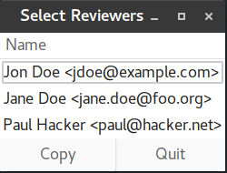

# reviewers.py - quickly add reviewers to git merge commit messages

## Introduction

This simple tool displays a customizable list of names and email addresses that
can be selected and copied into the clipboard for adding these names as
reviewers of a pull request to the merge commit messages (e.g. on github).

This tool was born out of my need to "scratch an itch" - I am the component lead
for the [Ceph Manager Dashboard](https://ceph.com/) and frequently have to
review and merge pull requests for this component. Adding the required
`Reviewed-by: Name <email>` lines to the pull requests that are being merged is
a manual process and I used a plain text file for cutting and pasting the
required lines before, which was cumbersome.

I know that there is actually a [command line
tool](https://github.com/batrick/ceph/blob/master/src/script/ptl-tool.py) for
handling Ceph merge requests, but I usually use the github web interface and I
wanted to have an excuse to dabble with the Python GTK bindings
;)

## Usage

Edit the file `reviewers.txt` and add the names and email addresses of the
reviewers you want to add to your commit messages.

The file format is simple:

* One reviewer per line
* The line should start with the name, followed by the corresponding email address

Simply start the script by executing `./reviewers.py`. By default, it will look
for a file `reviewers.txt` in the current directory. You can also pass an
alternative file name as the argument, e.g. `./reviewers.py ~/.reviewers.txt`.

A window will appear, displaying the list of names as defined in the file.



You can now select the desired names by clicking each of them while holding down
the `CTRL` key. Click **Copy** or press `Ctrl+C` or `Alt+C` to copy the list of
selected list of reviewers to the clipboard. The tool will automatically
preprend each line with the string `Reviewed-by: `. Example: clicking "Jane Doe"
and "Paul Hacker" will result in the following clipboard content:

```
Reviewed-by: Jane Doe <jane.doe@foo.org>
Reviewed-by: Paul Hacker <paul@hacker.net>
```

You can now paste the clipboard content into the merge commit message text.

Click **Quit** or press `Ctrl+Q` or `Alt+Q` to exit the application.

## Requirements

To run this tool, you need [Python 3](https://www.python.org/) and the
[PyGTK](http://www.pygtk.org/) Python bindings for the [GTK+
toolkit](https://www.gtk.org/). These components should be part of every recent
Linux distribution - see your distribution's documentation for details on how to
install them.

## License

This tool is licensed under the [MIT
License](https://opensource.org/licenses/MIT). See the file `LICENSE.txt` for
details.